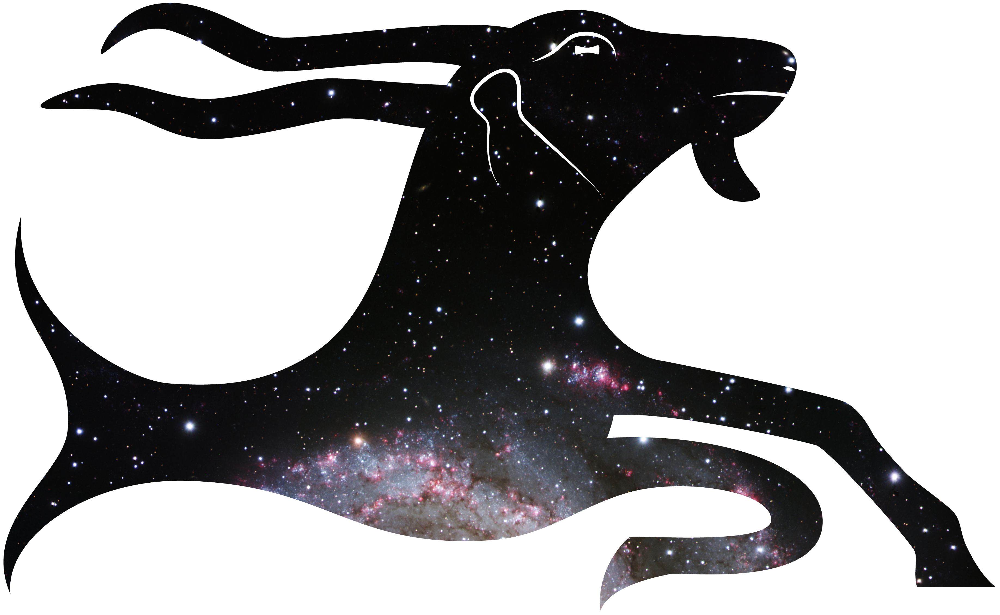

# The Zodiac Glossary

## ZODIAC – Ancient Astral Science in Transformation

This glossary of ancient terms is only one facet of the [Zodiac Project](https://www.geschkult.fu-berlin.de/e/zodiac/index.html), an ERC-funded academic research project hosted at the Freie Universität Berlin.

## Work-in-Progress Webpages

Visit the new permanent address of the Zodiac Glossary: [zodiac.fly.dev](https://zodiac.fly.dev) to keep up with the latest features as they become available.

An earlier prototype of the frontend is still accessible at its [github pages site](https://christiancasey.github.io/zodiac-routing/). This will become the front-facing interface for the fully-connected project. Note that the data shown here are only for demonstration purposes.

## About ZODIAC

Astrology, Astronomy, Mathematics, Religion and Philosophy – all these different aspects and their theories and practices, texts and images, meet in the concept of the zodiac. 2500 years ago, in the 5th century BCE, the introduction of the zodiac in Babylonia marked a turning point in human culture and science. The zodiacal turn was accompanied by a mathematical turn in the astral sciences and a personal turn in astrology. From Babylonia, zodiacal astral science spread to Egypt, the Greco-Roman world, and beyond.

